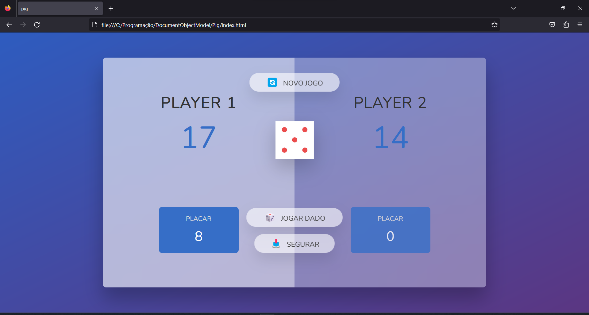
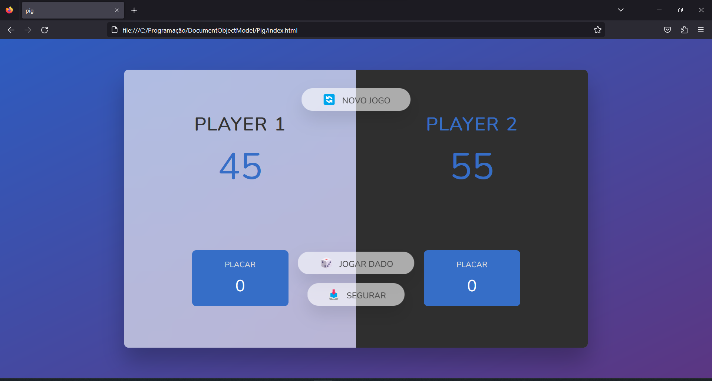

# pig-game

## Sobre
Projeto simples que consiste na manipulação da DOM (Document Object Model) para o funcionamento de um jogo de sorte em que o objetivo é conseguir 50 pontos, 
a cada dado jogado o número sorteado é adicionado ao seu placar momentâneo, porém se cair **1**, todo esse placar momentâneo é perdido 
e você perde sua vez, deixando o seu adversário jogar. Se não estiver se sentindo tão confiante, apenas segure o placar e adicionar ao 
total - Programado de forma imperativa.

### Conteúdos  
* [Sobre](#sobre)  
* [Tecnologias](#tecnologias)  
* [Quick Start](#quick-start)  
* [File Tree](#file-tree)  
* [Screenshots](#screenshots) 

## Tecnologias
* HTML
* CSS
* TypeScript

## Quick Start
**Visualizar**
* Baixar o repositório
* Descompactar a pasta
* Copiar o caminho do index.html e colocar na URL do navegador

**Modificar**
* Caso queira alterar, certifique-se que tenha uma versão do Node instalada, caso não tenha: https://nodejs.org/en/
* Tenha o TypeScript baixado globalmente, caso não tenha: `npm install -g typescript`
* Dentro de **./src** comece a modificar o arquivo index.ts e transforme o código em JS com `tsc` no terminal, ou `tsc -w` para atualizar automaticamente

Se caso houver algum erro no terminal relacionado a políticas de segurança, execute os comandos no CMD ou no próprio PowerShell com os comandos seguidos de 
".cmd" - 
```
tsc.cmd -w
```

## File Tree
```
.
├── public/
│   ├── assets/
│   │   └── ...
│   ├── css/
│   │   └── style.css
│   └── js/
│       └── script.js
├── src/
│   └── index.ts
├── .prettierrc
├── index.html
└── tsconfig.json
```

## Screenshots


